<picture>
  <source media="(prefers-color-scheme: dark)" srcset="dark.svg">
  <source media="(prefers-color-scheme: light)" srcset="light.svg">
  
</picture>
  

<picture>
  <source media="(prefers-color-scheme: dark)" srcset="about-dark.svg">
  <source media="(prefers-color-scheme: light)" srcset="about-light.svg">
  
</picture>
  

<picture>
  <source media="(prefers-color-scheme: dark)" srcset="credentials-dark.svg">
  <source media="(prefers-color-scheme: light)" srcset="credentials-light.svg">
  
</picture>
  

 
